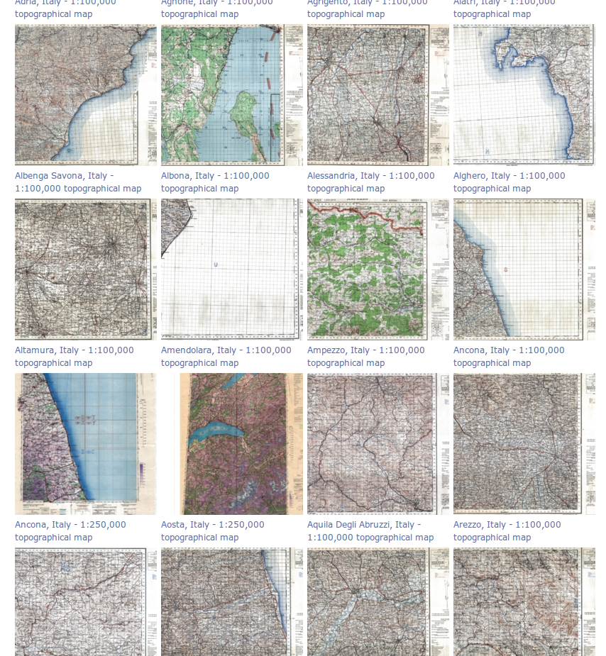

!SLIDE
# Nick Ruest #
## Digital Preservation Librarian, Repository Architect, and Digitization Coordinator ##

.notes KEEP CALM AND CARRY ON BRO

!SLIDE center

I am odd.

!SLIDE center

I don't really fit in anywhere, but I fit in everywhere?

.notes A position like mine does not fit perfectly into any single traditional library department. I like to joke that I have a lot of feet since I have a foot in nearly every department. I have a natural connection to IT given the tech behind most of what I do. But, at its heart, digital collections/preservation is just another form of collection development. I've bounced around a few departments (IT -> Research Collections -> Collections -> IT -> SCDS) over my time at Mac. But I think I have finally found a home in the centre. It is the best possible scenario at this point, and now I'm going to tell you why.

!SLIDE incremental
# INFRASTRUCTURE #

* Digitization
* Digital Respository
* Digital Preservation

.notes One of my standard phases at work is INFRASTRUCTURE! Given that when I started at Mac there was nearly zero infrastructure for digitization or repository structure, we had to basically start from scratch. Over the last few years we have built some decent infrastructure for digitization. We have a hosted institutional repository from Bepress (DigitalCommons) and we have the begun the work of building a solid local digital repository with Fedora Commons and Islandora. We're also slowly working on policy and best practices for digital preservation. 

!SLIDE
# Digitization #

* Local projects
  * Jewish Underground Resistance collection
  * World War, 1939-1945, German Concentration Camps and Prisons collection
  * Peace and War in the 20th Century
  * Historical Perspectives on Canadian Publishing
  * Masters and PhD theses
  * Book scanning

.notes Digitization is one thing we are *really* good at. We have digitized an insane amount of material over the last few years. But, the problem is a lot of it isn't publically available. This should begin to change very soon with the new digital repository. These are some local projects we have completed or are still ongoing. talk about each project briefly.

!SLIDE
# Digitization #

* Partnerships
  * Adam Matthews
    * World War I collections (~20k objects)
  * Gale
    * Holocaust and Jewish Resistance materials (~26k objects)
    * Pamphlet collections (starts in Febuary 2012

.notes besides or local projects, we have partnered with a couple of vendors to digitize entire collections. Normally hearing the word vendor partnership is something I would immediately scoff at, but these partnerships are not too bad when you think about them. talk about each partnership briefly.
        
!SLIDE
# Digitization #

* Challenges
  * Growing fast
  * Infrastructure
  * Public
  * Repository
  * Digital Preservation
  * Staffing

.notes As I previously touched on, in terms of digitization we have grown very quickly. This has caused a number of issues in regards to infrastrutre. Yes, we may have scanned a couple thousand books - but are they publically available? NO. What is needed is a health balance between digitization and infrastructure. What I mean by infrastructure is having a repository to put all this stuff and make it publicly available. Thousands upons thousands of digital objects sitting on a storage arrays is of no use to anybody, and presents any number of issues in regards to digital preservation. What is truly needed is proper staffing, hardware infrastructure, and repository platform combined with some robust workflows and policy. None of which is easy in a spartan environment.

!SLIDE incremental
# Digital Repository #

.notes architecting a digital repository. a lot of planning involved. we have a lot of disparate already around, and what we really need is a central place to keep of this stuff. ONE REPOSITORY TO RULE THEM ALL! What we are building is a Fedora Commons and Islandora powered repository. We went the Islandora route as opposed to Hyrdra because of our current library infrastructure is pretty much all drupal powered, and folks are familar with it. Also, Islandora has a really great community that is rapidly growing right now.

!SLIDE center

.notes you really can't see anything, but this is kinda the point. it is a visual aid for people to understand just how much goes into the repository and what it covers. this is an on going and constantly evolving structure.

!SLIDE center

http://ruebot.net/macrepo-visual/index.html

.notes this is a zoom in section of the william ready division of archives and research collections, and this represents materials we have already digitized and can be ingested into the repository.

!SLIDE center

.notes last week we had successfully ingested our first collection into the repository - a collection of italian topographical maps from world war II. 

!SLIDE center

.notes this is a shot of the djatoka powered islandora image viewer. we finally have a "easy" way display jpeg2000s.

!SLIDE
# Digital Preservation #

* DOCUMENTATION DOCUMENTATION DOCUMENTATION
* POLICY POLICY POLICY
* Technical stuff
  * Infrastructure
  * Code
* THE COMMUNITY IS YOUR BEST FRIEND!

.notes I don't have time to go into a full blown digital preservation talk here, so I will keep it really brief. At its heart, digital preservation is a series or organizational changes. Your organization must be commited to these changes in practice else all will be for naught. So, basically there will be a lot of documentation. Document everything you do. Documention every change to a object, and transaction with that object. Policy-wise, all of your digital preservation practices must be tied to some sort of organization policy. Something to fall back on. And, as for the technical stuff, you need a solid infrastructure. A repository, and microservices to take care of the tedious nitty-gritty stuff like automatically converting tifs to jpeg2000s upon ingest. There is a wonderful community around all of this, and it is without a doubt your bestfriend.

!SLIDE center
# Support #

!SLIDE
# What can the repo and/or I do or provide? #

* APIs
* Text and data to analyze

.notes Besides the standard ingest, search and discover of object, we have APIs (robust fedora apis and drupal apis) Text and data analysis - the giant corpus of all of our digitized and ocr'd books.
  
!SLIDE center
#Education & Knowledge Sharing #

!SLIDE center
# Ingest #

.notes Policy on what is required to ingest a collection into the repository - this is minumum requirements for objects and associated metadata

!SLIDE center
# Preservation #

.notes Consulting on best practices for digital preservation for a project, our us taking ownership of the objects archival versions of the objects. so education and knowledge sharing regarding international standards for preservation copies of objects, then "us" becoming stewards of the data.

!SLIDE center
# Harvesting #

.notes Harvesting - (ASK HOW MANY PEOPLE KNOW WHAT OAI-PMH IS - THEN OKAY, HOW MANY HUMANIES, DAY-TO-DAY FACULTY MEMBERS KNOW WHAT IT IS. DO THEY KNOW WHAT ATOM IS? DO THEY KNOW WHAT RSS IS?) knowledge sharing about what harvesting is, and what can be done with it.

!SLIDE center
# Metadata #

.notes Metadata - best practices, and guidance for setting up metadata requirements for a project. so, this is asking questions about the objects. IS THIS RUN OF THE MILL DC? IS THIS MODS? IS THIS DARWIN CORE? ARE WE GOING TO WRAP THIS ALL UP IN SOME DURTY METS? BUT REALLY, NO. BASICS. WHAT CAN YOU REALISTICALLY TELL MEOR YOUR INTENDED AUDIENCE ABOUT THIS OBJECT - THINKING BARE MINUMUM DUBLIN CORE THE ENTIRE TIME.

!SLIDE center

!SLIDE center
# Project management #

.notes Project management - JOHN HIT ON THIS EARLIER - GO ALL KANYE - Guidance and knowledge sharing on project management. We've all had our hands in a number of projects, and lead our fair share. Here we share our best practices and can provide a sort of mentoring role, or actual project lead.

!SLIDE center
# Version control #

.notes Version control - John touched on this earlier, but we are huge version control advocates, specifically git. We can provide a lot of support and guidance in transitioning a project to version control, or from another system to git, or just the odd git question.

!SLIDE
# STEALTH #
## SCHOLARLY COMMUNICATION ##

.notes FINALLY, TO HORRIBLY WRAP THIS WHOLE THING UP. REALLY, WHAT WE ARE DOING IS SOME BIZARRE VERSION OF SCHOLARLY COMMUNICATION. WE'RE LIASING WITH FACULTY AND STUDENTS. WE'RE LISTENING TO THEIR CONCERNS, ISSUES, AND PROBLEMS AND TRYING TO PROVIDE A SOLUTION ALL WHILE SHARING OUR EXPERIENCE/KNOWLEDGE AND BEST PRACTICES. THEN AT THE SAME TIME, CAPTURING THEIR SCHOLARLY OUTPUT. WHICH, INCLUDES THE DATA AND FINAL OUTPUT OF THEIR RESEARCH. 

!SLIDE center
# Contact info #
* email: ruestn@gmail.com
* twitter: ruebot
* github: http://github.com/ruebot

!SLIDE
# QUESTIONS? #
